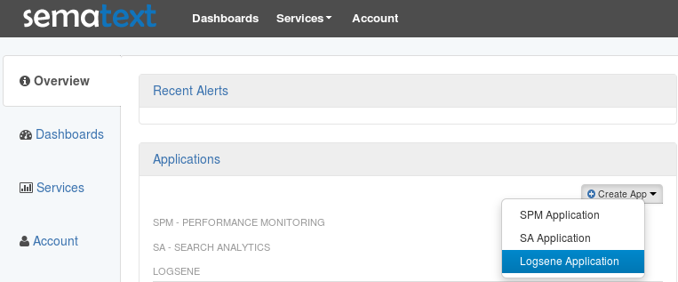
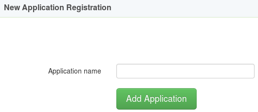
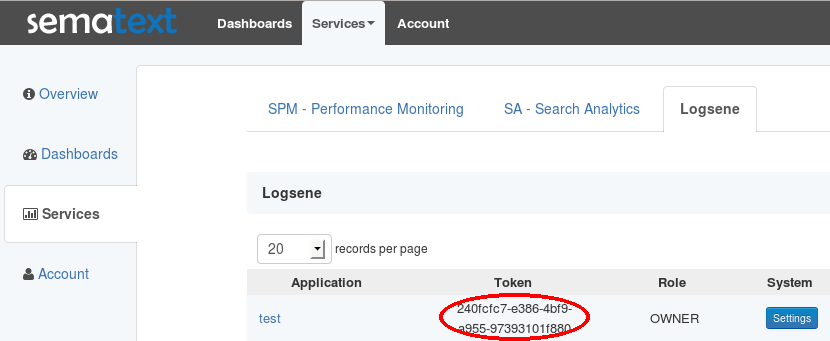
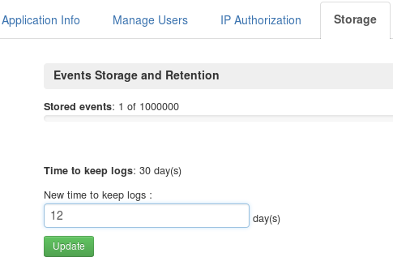

Welcome to [Logsene](http://sematext.com/logsene/) documentation\!  If
you are new to Logsene, think of it as logging as a service - Logsene is
your own logging box in the cloud, a free alternative to Splunk, or even
as Hosted Elasticsearch, since one of the APIs Logsene exposes is
[Elasticsearch API for indexing](Index-Events-via-Elasticsearch-API) and
[searching](Searching-Your-Events).

Below, you can find how you can get started, and on the right side, you
can go to specific pages to get a more in-depth view into using Logsene.

#### Creating a Sematext Account

If you don't already have an account at Sematext, you'll need to create
one. To do that, go to <https://apps.sematext.com/> and click
on 

You just have to type in your Email and password, and you'll get an
Email to confirm your account.

Once you click on the link from your Email, your account gets activated,
and you can go on and create your Logsene application by clicking on the
**Create Logsene Application** button.

#### Creating a Logsene Application

After you get logged in to <https://apps.sematext.com/>, the first step
is to create an application. An application is an independent container
for your data. For example, if you have a development and a production
environment, it might make sense to have one application for each. You
can create as many applications as you want.

To create a Logsene application, log in to <https://apps.sematext.com/>,
click on the **Create App** button and select **Logsene Application**.
You can always go back to the overview screen of your account by
clicking on the **Account** link of the header.



And then you'd only have to choose a name:



And you're done\! You will get a confirmation screen that tells you how
to [send data to your new application](Sending-Events-to-Logsene). Once you start
sending data, you can start [searching and analyzing those events](Searching-Your-Events). Click on **Go to Reports**
to open the native Logsene UI and on **Go to Kibana** to [explore your data with Kibana](Kibana).

#### Adding Data to Your Application

As described in the "Application Added" screen, there are two ways to
send data: [through Elasticsearch's API](Index-Events-via-Elasticsearch-API) or [through syslog](Syslog).

##### Elasticsearch API (Logstash & friends)

The easiest way to send logs from your files is
[through](Logstash)[Logstash](Logstash). You
can also use any tool that works with Elasticsearch's REST API, for both
[indexing](Index-Events-via-Elasticsearch-API) and
[searching](Search-through-the-Elasticsearch-API). The
only condition is to use the application's token as the index name, and
**http://logsene-receiver.sematext.com:80** as the address. The token
for each of your applications can be found by logging in to
<https://apps.sematext.com> and going to your Services -\> Logsene tab:
<https://apps.sematext.com/users-web/services.do#logsene>



For more details on using the Elasticsearch REST API with Logsene, visit
the following page: [Index Events via Elasticsearch API](Index-Events-via-Elasticsearch-API). Note that the API
supports both HTTP and HTTPS. The HTTPS endpoint would be
**https://logsene-receiver.sematext.com:443**

##### Syslog

You can forward syslog via **UDP** (port 514), **TCP** (port 514),
**RELP** (port 20514) and **TLS** (port 10514). The host name is
**logsene-syslog-receiver.sematext.com**.

To get started quickly, you can use our configuration script and add
your application token as a parameter:

``` bash
curl -O https://apps.sematext.com/logsene/configure-syslog.py
sudo python configure-syslog.py $ADD-YOUR-APPLICATION-TOKEN-HERE
```

For more details, take a look at the [Syslog](Syslog) page,
and the pages that are linked from it.

#### Searching and Visualizing Your Data

For searching and visualizing, you have two UIs that you can use out of
the box:

  - the native Logsene UI
  - [Kibana](Kibana)

##### Opening the Native UI

To open the native UI, click on the application's name, from the
Services -\> Logsene tab of your account.

##### Opening Kibana

To visualize your data using [Kibana](Kibana), you have to
click on the **Kibana** button next to the application's name, from the
Services -\> Logsene tab of your account.

#### Change Your Application's Settings

From the Services -\> Logsene tab of your account, you can click on
the  button next to your
application to change its settings, which will give you an overview of
who has access to your application from their own Sematext account.

From there, you can:

  - invite new users to your application
  - [authorize public IPs to send data to your application via syslog](Authorizing-IPs-for-Syslog)
  - adjust the retention time
  - check how much data is currently stored
  - [change your plan](Logsene-FAQ/#plans-prices)

##### Invite Users

Inviting new users makes them see your Logsene application in their
Sematext[account. You can also make them ADMINs, which enables them to change some of the application's settings, too.](http://apps.sematext.com)


##### Authorize IP for Syslog

When you [send data via TCP/UDP/RELP syslog](Syslog), you
can authorize by using the Logsene application token, or by registering
your public IP address. If you choose registering IPs, [this page](Authorizing-IPs-for-Syslog) will guide you on doing
that from your application's settings or from the Logsene Application
screen.

##### Storage and Retention

The Storage tab shows you how many logs are stored in your application,
out of the total number of logs[allowed by your plan](Logsene-FAQ/#plans-prices).
To prevent you from hitting the limit, old logs are being removed based
on how long you choose to keep them. By default, the retention time is 7
days, which implies that logs with the value of the **@timestamp** field
older than 7 days are removed. You can change the retention time from
the Storage tab:



#### Getting Support

We hope you enjoy using Logsene. If you need further support, or have
any feedback regarding our products, please don't hesitate to [contact us](mailto:logsene-support@sematext.com)\!

