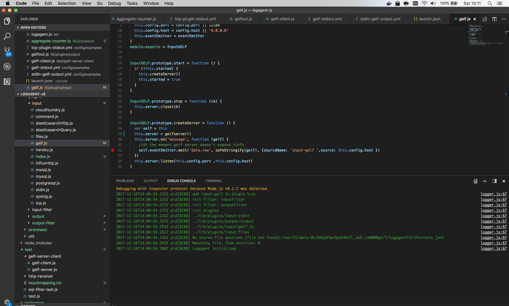
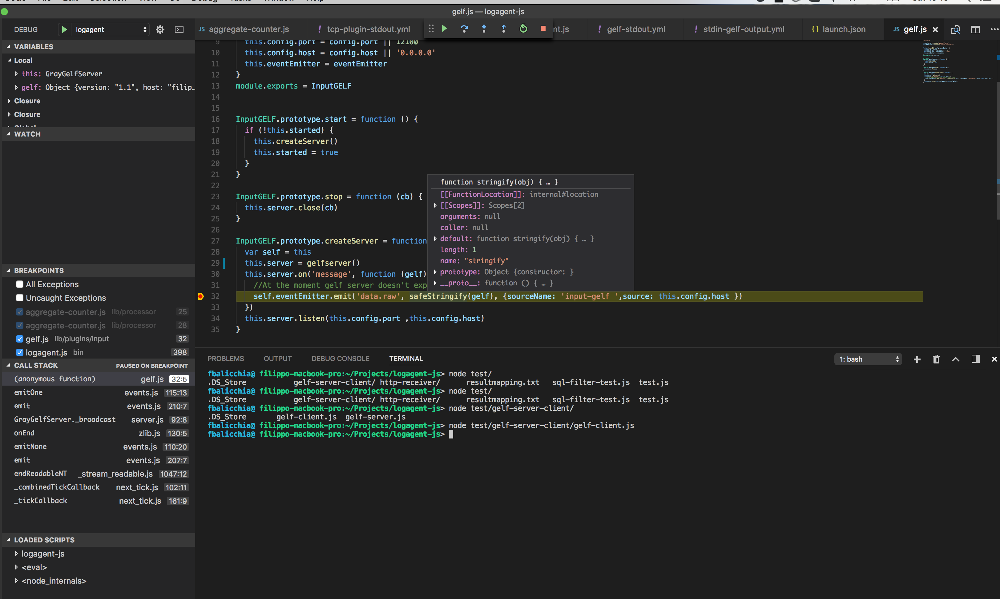

### Import Logagent :

Here we try explain how to debug and improve using Visual source Code. After [downloaded](https://code.visualstudio.com/Download) and import Logagent project, is possible to debug configuring `launch configuration` like this:

```
{
    // Use IntelliSense to learn about possible attributes.
    // Hover to view descriptions of existing attributes.
    // For more information, visit: https://go.microsoft.com/fwlink/?linkid=830387
    "version": "0.2.0",
    "configurations": [

    {
        "type": "node",
        "request": "launch",
        "name": "logagent",
        "program": "${workspaceFolder}/bin/logagent.js",
        "args": [
            "-c",
            "/Users/fbalicchia/Projects/logagent-js/config/examples/gelf-stdout.yml",
            ""
        ],
        "console": "externalTerminal"
    }
    ]
}

```
`"console": "externalTerminal"` configuration permit us to open an external console for use stdin/stdout in case your configuration use console plugin to interact with user.

### Example :
Now its time to try to resolve our problem tring to figure out a solution, for example we can put a **breakpoint** in gelf input plugin on event message 

s

for complete this example we need to produce a message from gelf client for example typing from termina tab


then our will stop on our breakpoint start to figure out a solution.




Can be useful to install EsLint plugin to check our code during our works

### Useful Plugins to install : 

Visual source Code provide al lot of plugins, one of those very useful is ESLint plugin that permit us to find bugs and permit us to create a more consistent code


